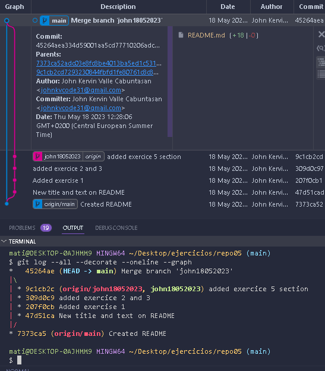

# EJERCICIO 5
Ejercicio donde haremos un merge sin fast forward.
* __EJERCICIO5__
    * __Ej1__
      * Creamos un repositorio *LOCAL* con los siguientes pasos en el terminal:
        * `mkdir repo05/` creamos la carpeta 
        * `cd repo05` vamos dentro de la carpeta
        * `git init` iniciamos repositorio
      * Creamos un repositorio *REMOTO* público en la página de github.
    * __Ej2__
      * Creamos el archivo README.
    * __Ej3__
      * Para crear el branch haremos lo siguiente en el terminal:
        * `git branch name18052023` creamos un nuevo branch
        * `git checkout name18052023` nos situamos en el branch
    * __Ej6__
      * Para hacer el merge haremos lo siguiente:
        * `git checkout main` nos movemos al branch main para aplicarle todos los cambios hechos en el otro branch
        * `git merge --no-ff name18052023 -m "comment"` indicamos que haremos un merge de la rama externa al main y le pondremos un comentario
        * `git push` para mandar los cambios al *RepRemoto*
    * __Ej7__
      *    
    * __Ej8__
      * La principal diferencia de un merge FF y un sin FF es:
        * __Al hacer merge con FF__ lo que pasa es que se aplican todos los cambios y todos los commits del branch a la principal
        * __Al hacer merge sin FF__ solo hace merge al __resultado__ (los cambios y adiciones) de la rama externa y no tanto en el proceso (commits) de esta. Como mucho puedes acceder tanto al proceso inicial como al proceso final.
# EJERCICIO 6
* __EJERCICIO6__
  * __Ej1__ 
       